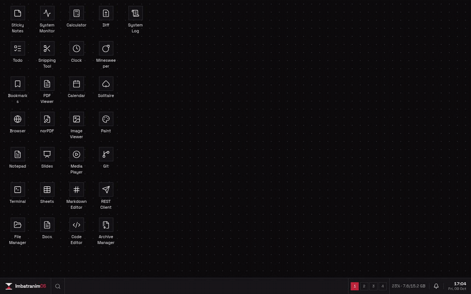
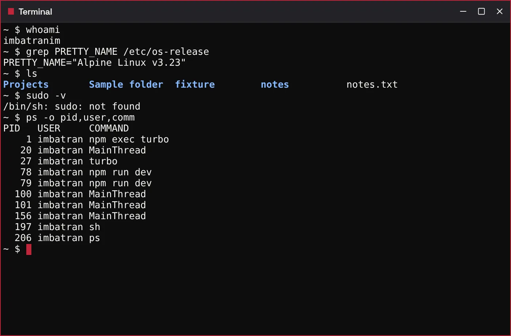
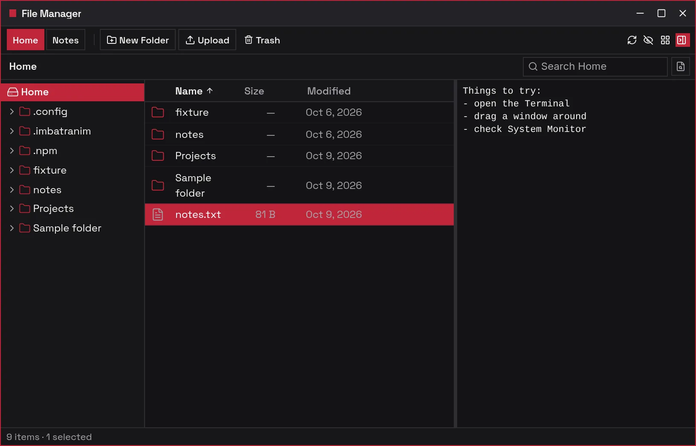
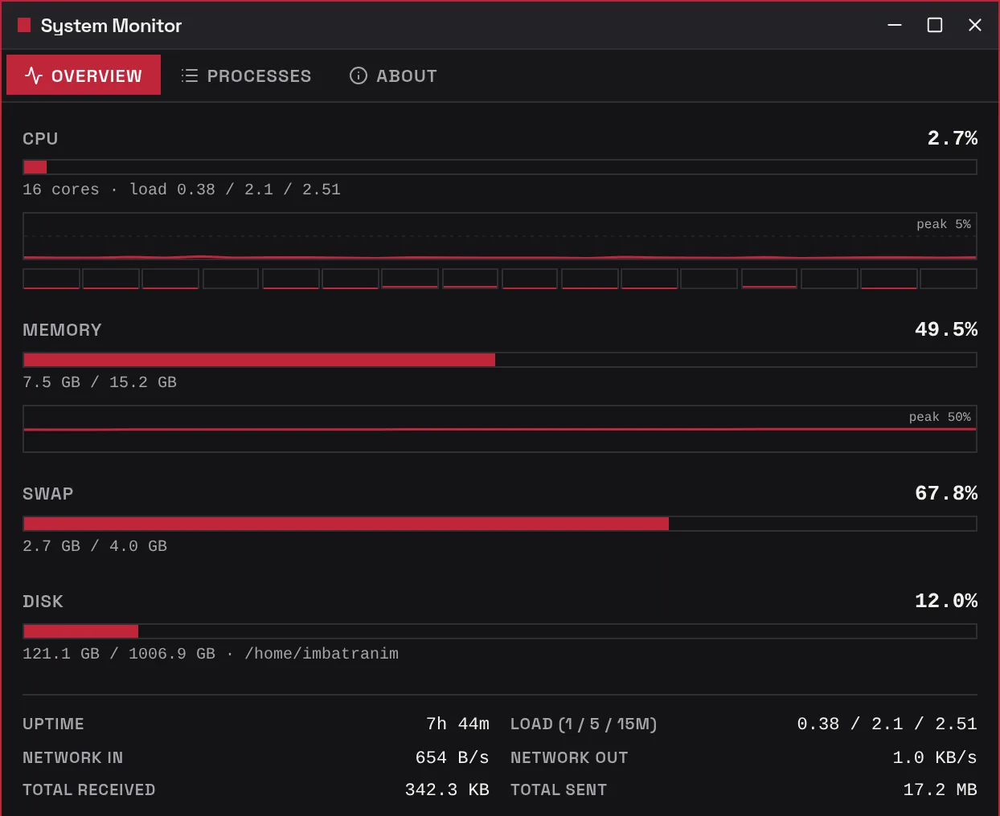
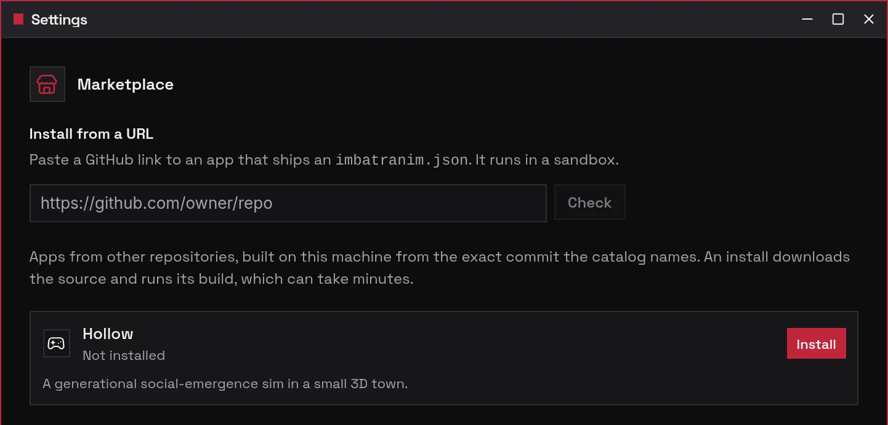

# ImbatranimOS

A small Linux computer whose screen is a browser tab. One Docker container runs Alpine Linux with a real shell, real files and real processes, and you use it through a Windows 7-style desktop in any browser. It is for anyone with Docker who wants a personal machine they can open from anywhere.

<p align="center">
  
</p>

**Status:** v1, declared on 2026-10-07; a personal project in daily use, still changing. The owner's machine runs at <https://gandolh.ro/imbatranim-os/>, but it has one owner, so all you will see there is the sign-in screen. Run your own with the three commands below.

The name is a joke: *îmbătrânim* is Romanian for "we're getting old".

## What it does

- Gives you a real shell in the Terminal app: a PTY on the container, running as the unprivileged `imbatranim` user.
- Opens the container's actual home folder in Files. It lives in a Docker volume, so it survives rebuilds, and Settings → Backup downloads it as one archive.
- Shows the container's real CPU, memory, disk and processes in System Monitor.
- Comes with about 30 apps: Notepad, Sheets, Docs, PDF tools, a Monaco code editor, Git, a REST client, Paint, Minesweeper and more. The Browser app fetches pages from the machine, not from the browser you are sitting at.
- Installs more apps from the reviewed catalog in [`marketplace/`](marketplace/README.md), or from any GitHub repository into a sandboxed frame.

Web desktops such as daedalOS run entirely in the tab and keep their files in browser storage. Here the tab only draws the screen; the files, the shell and the processes belong to a Linux machine you own. It has one owner and no other accounts, no sudo, and no two-factor sign-in.

## Screenshots

| Terminal: a shell inside the container | Files: the home folder on the volume |
|---|---|
|  |  |
| **System Monitor: live numbers from the machine** | **Marketplace: the catalog, and installs from a URL** |
|  |  |

## How it works

A NestJS server inside the container serves the React desktop and the API on one port. The desktop (`apps/core`) draws the windows, the Start menu and the taskbar; each app is its own package under `apps/add-ons/` and reaches the machine through a `system` handle the desktop gives it. The Terminal streams a node-pty shell over an authenticated WebSocket, Files and System Monitor call the REST API, and every route outside sign-in needs the owner's session. The server sends data, never pixels. More in [docs/architecture.md](docs/architecture.md).

## Run it locally

Requires Docker with Compose. Everything is built from this repository; there is no published image.

```bash
git clone https://github.com/gandolh/ImbatranimOS.git
cd ImbatranimOS
docker compose -f infrastructure/docker-compose.yml up imbatranimos
```

Then open <http://localhost:8080>. The first visit asks you to set up the machine: pick a name and a password of at least 10 characters. There is no default password.

For development, the tests and the dev container's sign-in, see [docs/getting-started.md](docs/getting-started.md). To put it behind HTTPS, see [infrastructure/README.md](infrastructure/README.md).

## Project layout

| Path | What lives there |
|---|---|
| `apps/core` | The desktop: shell, window manager, sign-in, Settings |
| `apps/add-ons/` | One package per app: Terminal, Files, Sheets and the rest |
| `apps/backend` | The NestJS API: shell, files, system stats, backup, marketplace |
| `apps/docs` | The documentation site, built from `corpus/` and the code |
| `packages/` | `@imbatranim/ui`, the kit apps are built with, and the PDF engine |
| `infrastructure/` | Dockerfile, compose file, Caddy example, HTTPS and sign-in notes |
| `marketplace/` | The catalog of installable apps |
| `iso/` | The older kiosk ISO build; a server ISO is planned |
| `corpus/` | The project wiki: decisions, status, briefs |

## Docs

- [docs/](docs/README.md): setup, architecture, backup and a lost password, adding an app, and how the images here were made
- [infrastructure/README.md](infrastructure/README.md): HTTPS, the sign-in, the Browser's second port
- [apps/docs](apps/docs/README.md): the documentation site's source, with a tour of the desktop and an API reference generated from the code (`npm run docs`)
- [Project wiki](corpus/index.md): decisions, status and the briefs that built it

## License

[AGPL-3.0-only](LICENSE). The Docs app is built on [SuperDoc](https://github.com/Harbour-Enterprises/SuperDoc), which is AGPL-3.0, so the whole repository uses the same license. If you run a modified version as a network service, you must offer its source to the people who use it.
