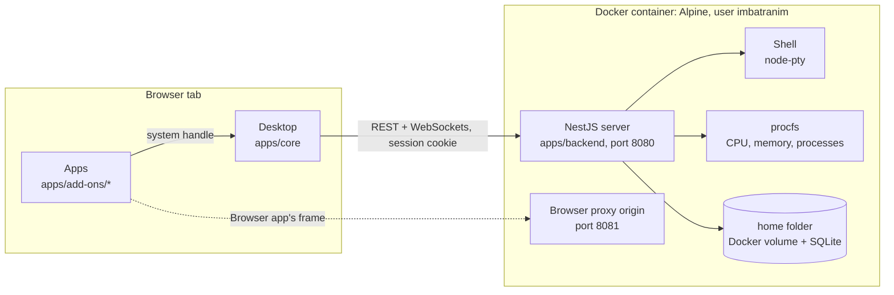

# Architecture

One Docker container is the computer and the browser is its screen. Inside the container, a NestJS server (`apps/backend`) serves the built React desktop and the API on one port. The desktop (`apps/core`) draws the windows, the Start menu and the taskbar. Each app is its own package under `apps/add-ons/`, and talks to the machine through a `system` handle the desktop gives it. The server sends data (shell bytes, file listings, numbers from `/proc`), never pixels.

## Opening the Terminal, step by step

1. You open the machine's address. NestJS serves the desktop's static files.
2. The desktop asks `GET /api/identity` who is signed in. With no session it shows the setup or sign-in screen; signing in sets the `imb_session` cookie.
3. Start → Terminal. The desktop opens a window and mounts the Terminal app, handing it the `system` handle.
4. The app opens a WebSocket to `/api/pty`. The server checks the session on the upgrade and starts a shell with node-pty, as the `imbatranim` user.
5. Keystrokes go up the socket and the shell's output comes back; xterm.js draws it.
6. Files and System Monitor work the same way over REST (`/api/files`, `/api/system`), and every API route needs the session except `GET /api/identity`, setup, sign-in, sign-out and the health check.

## No root, by design

Everything inside the container, the shell you get in Terminal and the process that serves the desktop, runs as `imbatranim`, an unprivileged user created in the image. There is no sudo, and the container is not meant to run as root or privileged. Features that would need root are on the project's rejection list ([corpus/wiki/real-os-gaps.md](../corpus/wiki/real-os-gaps.md)).

## Apps from outside the repo

Settings → Marketplace installs more apps. An app described in [`marketplace/`](../marketplace/README.md) is cloned at a pinned commit, built inside the container and runs in the desktop's own page, so only reviewed code gets there. An app installed from any other GitHub URL must be prebuilt, and runs in a sandboxed frame whose only capability is `notify`.

## Going deeper

- [adding-an-app.md](adding-an-app.md): the add-on contract, with the steps to add one
- [corpus/wiki/architecture.md](../corpus/wiki/architecture.md): the stack, layer by layer
- [corpus/wiki/os-layering.md](../corpus/wiki/os-layering.md): the three layers and the `system` handle
- [infrastructure/README.md](../infrastructure/README.md): HTTPS, the sign-in and the Browser's second port
- The docs site's [architecture page](../apps/docs/src/content/docs/architecture.mdx) and [tour of the desktop](../apps/docs/src/content/docs/tour.mdx), plus an API reference generated from the code by `npm run docs` ([apps/docs](../apps/docs/README.md))
